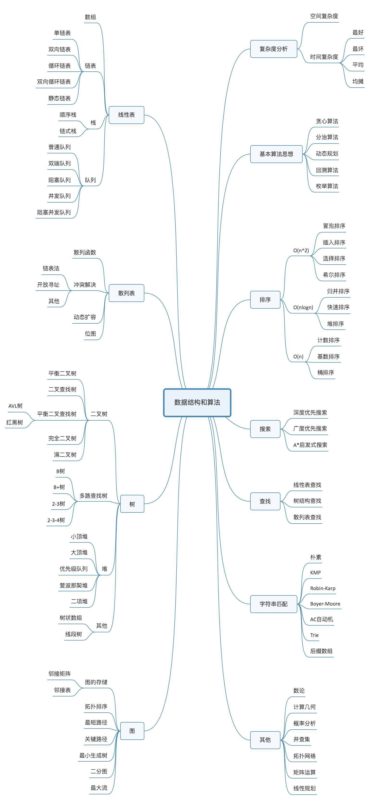

## 从零开始学习数据结构和算法

### 前言

数据结构和算法这道坎，我们总归是要迈过去的，为什么不是现在呢？

### 传送门

#### 数据结构

- [栈 - Stack](./src/data-structure/stack.md)
- [队列 - queue](./src/data-structure/queue.md)
- [链表 - linked-list](./src/data-structure/linked-list.md)
- [集合 - set](./src/data-structure/set.md)
- [树 - tree](./src/data-structure/tree.md)
- [字典 - dictionary](./src/data-structure/dictionary.md)
- [图 - graph](./src/data-structure/graph.md)

#### 算法

- [常用排序和搜索算法](./src/algorithm/sort)
  - 冒泡排序
  - 选择排序
  - 插入排序
  - 归并排序
  - 快速排序
  - 堆排序
  - 计数排序
  - 桶排序
  - 基数排序

### Map

### 总结

- 无他术，唯勤读书而多为之，自工