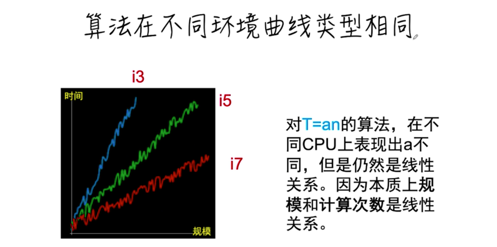

## 存放学习文档

### 目录
- [时间复杂度和空间复杂度](#时间复杂度和空间复杂度)
  - [插入排序时间复杂度分析](#插入排序时间复杂度分析)
  - [反转长度为n的数组的空间复杂度](#反转长度为n的数组的空间复杂度)
  - [二分查找的时间空间复杂度](#二分查找的时间空间复杂度)
- [复杂度的本质](#复杂度的本质)
- [递归函数复杂度分析方法](#递归函数复杂度分析方法)

### 时间复杂度和空间复杂度

时间复杂度衡量算法**执行时间**随着**输入规模**增加而增长的关系，是一种对算法的**分类**。

空间复杂度是指算法用了多少额外的空间。

#### 插入排序时间复杂度分析

最好最坏时间复杂度分析

#### 反转长度为n的数组的空间复杂度

#### 二分查找的时间空间复杂度

#### 二分查找小总结

#### k分查找

#### 二分查找递归时间空间复杂度

#### 思考

### 复杂度的本质

### 递归函数复杂度分析方法

