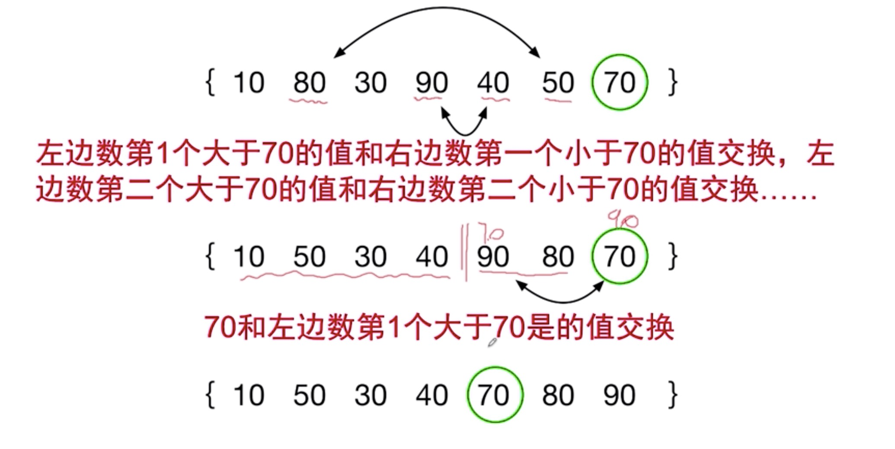
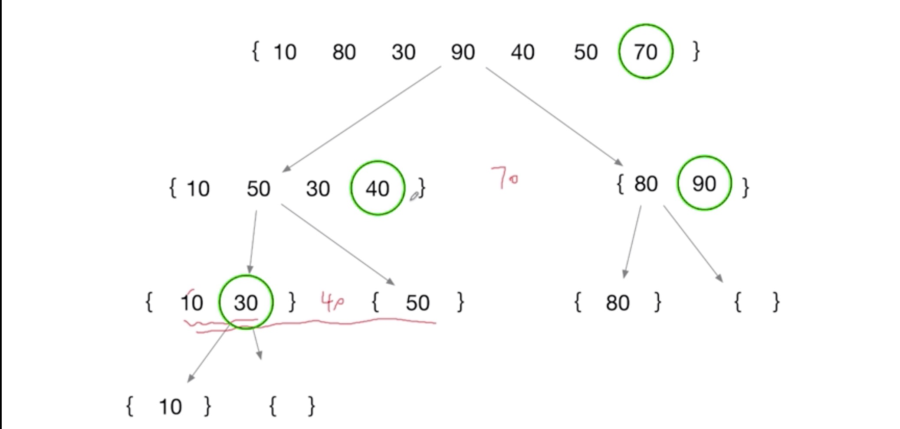
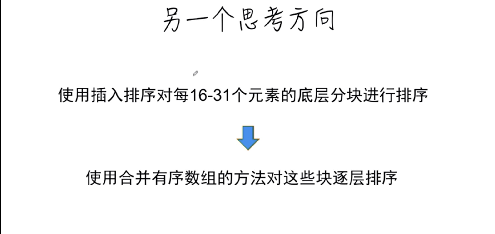
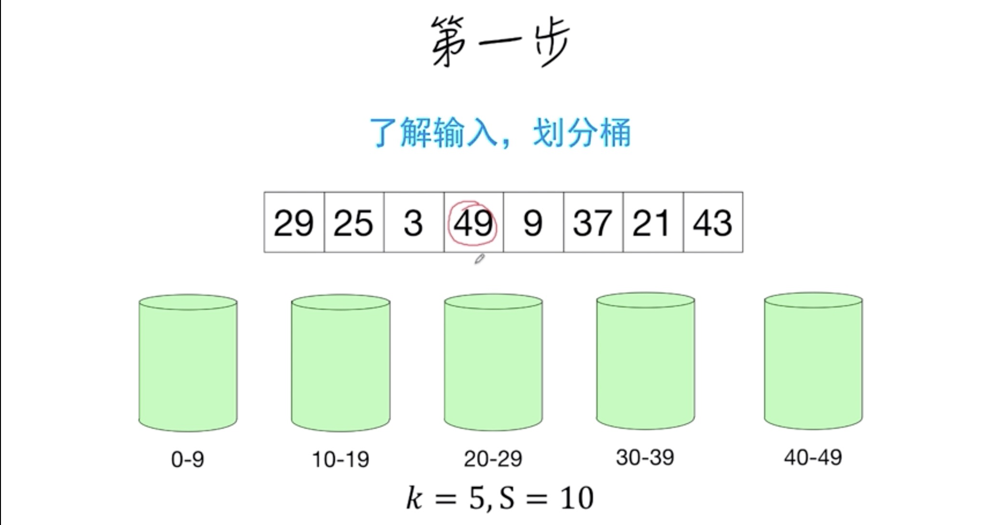

# 存放学习文档

## 目录
- [时间复杂度和空间复杂度](#时间复杂度和空间复杂度)
  - [插入排序时间复杂度分析](#插入排序时间复杂度分析)
  - [反转长度为n的数组的空间复杂度](#反转长度为n的数组的空间复杂度)
  - [二分查找的时间空间复杂度](#二分查找的时间空间复杂度)
- [复杂度的本质](#复杂度的本质)
- [递归函数复杂度分析方法](#递归函数复杂度分析方法)
- [排序算法](#排序算法)
    - [排序算法介绍](#排序算法介绍)
    - [基于比较的排序算法](#基于比较的排序算法)
    - [快速排序](#快速排序)
    - [合并排序的优化](#合并排序的优化)
    - [计数排序](#计数排序)
    - [基数排序](#基数排序)
    - [桶排序](#桶排序)
    - [外部排序](#外部排序)
- [递归](#递归)
    - [递归的基本概念](#递归的基本概念)
        - [汉诺塔](#汉诺塔)
    - [用递归绘制图形](#用递归绘制图形)
    - [递归和穷举问题](#递归和穷举问题)
        - [子集](#子集)
        - [全排列](#全排列)
    - [组合问题](#组合问题)
    - [递归空间优化](#递归空间优化)
    - [回溯算法](#回溯算法)
    - [重复子问题优化](#重复子问题优化)
        - 斐波那契数列优化
        - 斐波那契数列复杂版（上台阶）优化

## 时间复杂度和空间复杂度

时间复杂度衡量算法**执行时间**随着**输入规模**增加而增长的关系，是一种对算法的**分类**。

空间复杂度是指算法用了多少额外的空间。

### 插入排序时间复杂度分析

最好最坏时间复杂度分析

### 反转长度为n的数组的空间复杂度

### 二分查找的时间空间复杂度

### 二分查找小总结

### k分查找

### 二分查找递归时间空间复杂度

### 思考

## 复杂度的本质

## 递归函数复杂度分析方法

## 排序算法

## 排序算法介绍

## 基于比较的排序算法

## 快速排序

## 合并排序的优化

## 计数排序

## 基数排序

## 桶排序

## 外部排序

