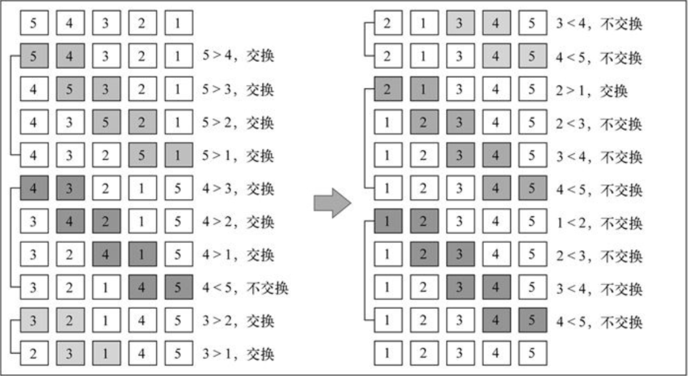
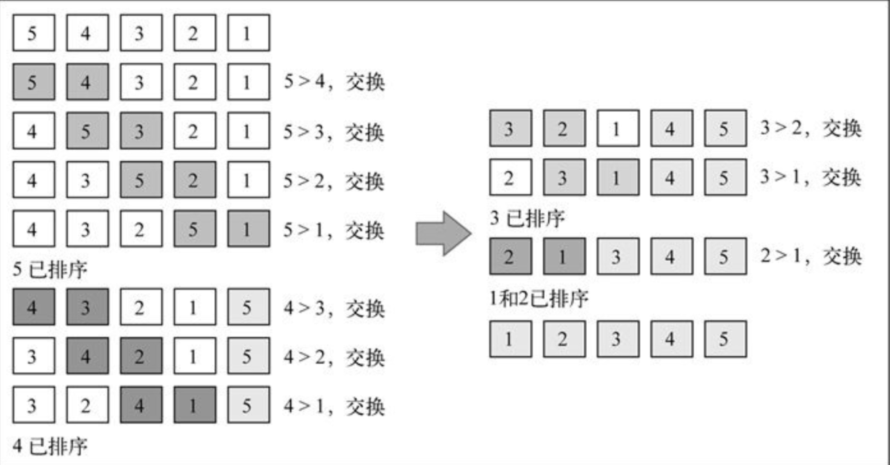
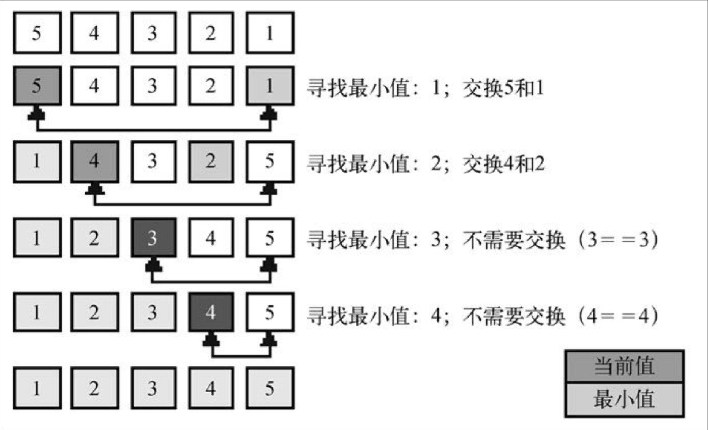
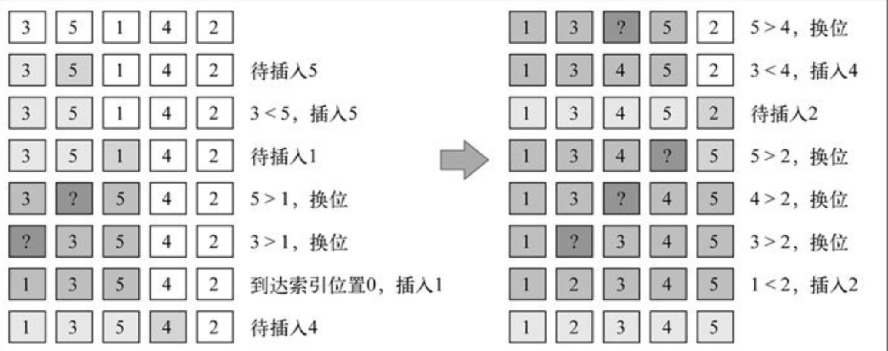
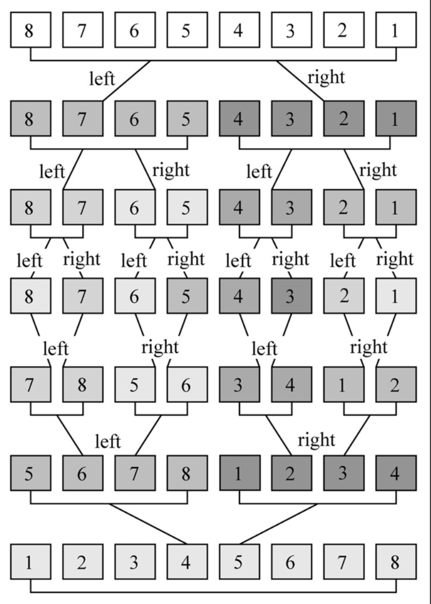
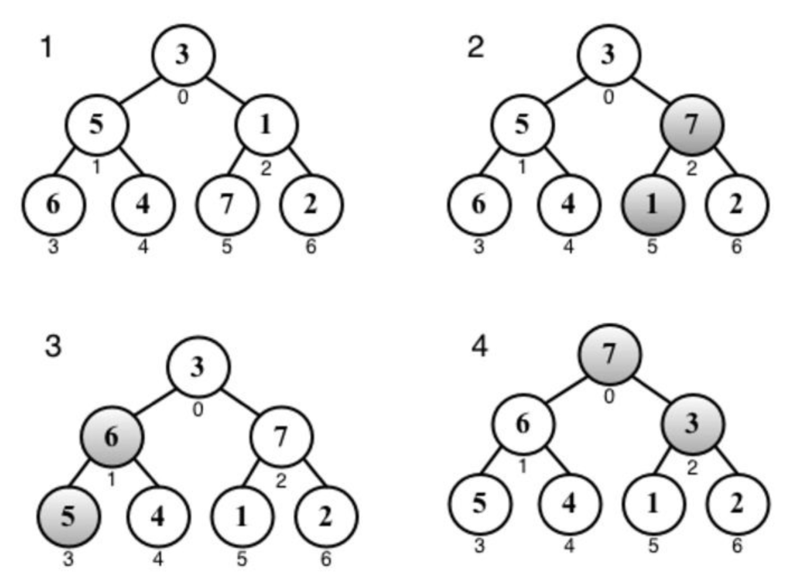
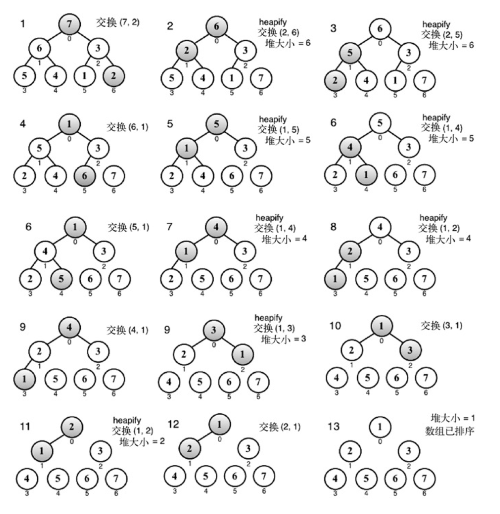
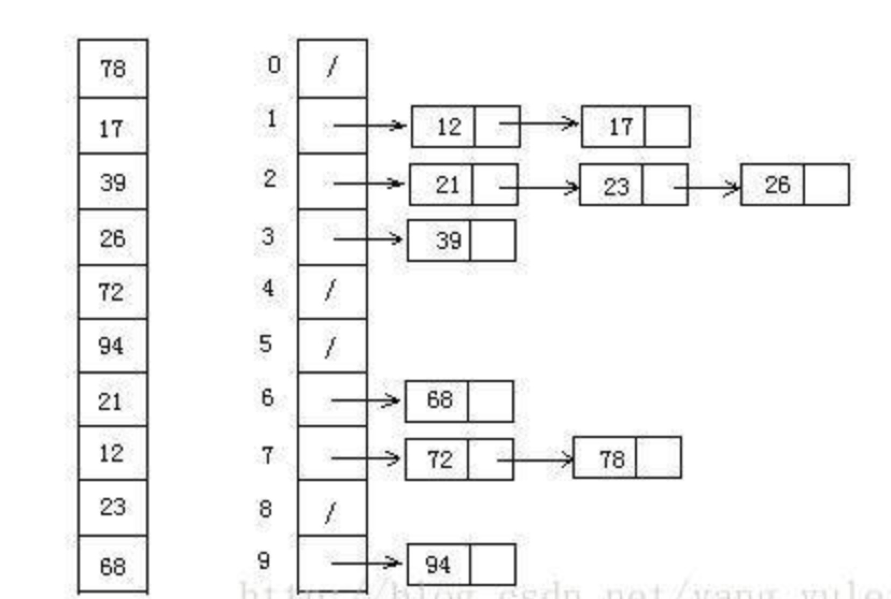

## 常用排序和搜索算法

### Catalog

- [冒泡排序](#冒泡排序)
- [选择排序](#选择排序)
- [插入排序](#插入排序)
- [归并排序](#归并排序)
- [快速排序](#快速排序)
- [堆排序](#堆排序)
- [计数排序](#计数排序)
- [桶排序](#桶排序)
- [基数排序](#基数排序)
### 冒泡排序

#### 思想

冒泡排序比较任何两个相邻的项，如果第一个比第二个大，则交换它们。

排序过程如下：


优化后排序过程：


#### 实现

- [简单冒泡排序](./bubble-sort.js)
- [冒泡排序优化](./bubble-sort-improved.js)

#### 时间复杂度

- 最佳情况：当输入的数组为已排好序 T(n) = O(n)
- 最坏情况：当输入的数组为反序时 T(n) = O(n2)
- 平均情况： T(n) = O(n2)

时间复杂度为`O(n2)`

#### 使用

```js
import { bubbleSort } from 'ct-dsa'
function createNonSortedArray(){
  var array = [];
  for (let i = 5; i > 0; i--){
      array.push(i);
  }
  return array;
}

const array = bubbleSort(createNonSortedArray());
console.log(array);
```

#### 应用

-

### 选择排序

#### 思想

选择排序是一种原址比较排序算法。大致思路是找到数据结构中的最小值并将其位置放在第一位，接着找到第二小的值并将其放在第二位，以此类推。

排序过程如下：


#### 实现

- [选择排序](./selection-sort.js)

#### 时间复杂度

- 最佳情况： T(n) = O(n2)
- 最坏情况： T(n) = O(n2)
- 平均情况： T(n) = O(n2)

平均情况时间复杂度为`O(n2)`

#### 使用

```js
import { selectionSort } from 'ct-dsa'
function createNonSortedArray(){
  var array = [];
  for (let i = 5; i > 0; i--){
      array.push(i);
  }
  return array;
}

const array = selectionSort(createNonSortedArray());
console.log(array);
```

#### 应用

-

### 插入排序

#### 思想

插入排序每次排一个数组项，以此方式构建最后的排序数组。假定第一项已经排序好了，接着，它和第二项进行比较，第二项是应该待在原位还是插入到第一项之前呢？这样，头两项就已正确排序，接着和第三项比较（它是该插入到第一、第二还是第三的位置呢？），以此类推。

排序过程如下：


#### 实现

- [插入排序](./insertion-sort.js)

#### 时间复杂度

- 最佳情况：输入数组按升序排序  T(n) = O(n)
- 最坏情况：输入数组按降序排序 T(n) = O(n2)
- 平均情况： T(n) = O(n2)

平均情况时间复杂度为O(n2)，不过在小型数组时，此算法比选择排序和冒泡排序性能要好。

#### 使用

```js
import { insertionSort } from 'ct-dsa'
function createNonSortedArray(){
  var array = [];
  for (let i = 5; i > 0; i--){
      array.push(i);
  }
  return array;
}

const array = insertionSort(createNonSortedArray());
console.log(array);
```

#### 优化

- todo: 使用**二分查找**优化插入排序 `while (j > 0 && array[j - 1] > temp) {`

#### 应用

- chrome下的[v8](https://github.com/v8/v8/blob/ad82a40509c5b5b4680d4299c8f08d6c6d31af3c/src/js/array.js##L760:7)在数据量小于10时使用插入排序，大于10时使用快速排序。

### 归并排序

#### 思想

归并排序是一种分治算法。其思想是将原始数组切分成较小的数组，知道每个小数组只有一个位置，接着将小数组归并成较大的数组，直到最后只有一个排序完毕的大数组。

排序过程如下：


#### 实现

- [归并排序](./merge-sort.js)

#### 时间复杂度

- 最佳情况： T(n) = O(n)
- 最坏情况： T(n) = O(nlogn)
- 平均情况： T(n) = O(nlogn)

平均情况时间复杂度为O(nlogn)

#### 使用

```js
import { mergeSort } from 'ct-dsa'
function createNonSortedArray(){
  var array = [];
  for (let i = 5; i > 0; i--){
      array.push(i);
  }
  return array;
}

const array = mergeSort(createNonSortedArray());
console.log(array);
```

#### 应用

- Firefox使用归并排序实现内部的sort方法

### 快速排序

#### 思想

和归并排序一样，快排也使用分治的方法，将原始数组分为较小的数组。

- 首先，从数组中选择一项作为主元。
  - 最简单的是选择数组第一项。但研究表明，对于几乎已排序的数组，这会导致时间复杂度最坏到O(n2)。
  - 另一种是选择数组的中间项。也是本库的实现方式。
  - 还可以随机选择一个数组项。
- 新建两个新数组，将原数组遍历，小于主元的值放入`left`数组，大于主元的值放入`right`数组。
- 将`left`和`right`递归进行此操作，直到数组长度为1即已排序好为止。
- 将`left``主元``right`归并起来即为已排好序的数组。

#### 实现

- [快速排序](./quick-sort.js)

#### 时间复杂度

- 最佳情况： T(n) = O(nlogn)
- 最坏情况： T(n) = O(n2)
- 平均情况： T(n) = O(nlogn)

平均情况时间复杂度为O(nlogn)，且它的性能比其他复杂度为O(nlogn)的排序算法要好。

#### 使用

```js
import { quickSort } from 'ct-dsa'
function createNonSortedArray(){
  var array = [];
  for (let i = 5; i > 0; i--){
      array.push(i);
  }
  return array;
}

const array = quickSort(createNonSortedArray());
console.log(array);
```

#### 应用

- chrome下的[v8](https://github.com/v8/v8/blob/ad82a40509c5b5b4680d4299c8f08d6c6d31af3c/src/js/array.js##L760:7)在数据量小于10时使用插入排序，大于10时使用快速排序。


### 堆排序

#### 思想

堆排序是一种很高效的算法，因为它把数组当做二叉树来排序。

堆具备的特性：
  - 索引0是树的根节点
  - 除根节点外，任意节点N的父节点是N/2
  - 节点L的左子节点是2*L
  - 节点L的右子节点时2*L+1

也基于大根堆的特性：
  - 父节点的值始终比子节点值大
  - （小根堆则相反，父节点的值小于子节点的值）

对数组`[3，5，1，6，4，7，2]`构建成大根堆的过程如下：


然后进行堆排序


#### 实现

- [堆排序](./heap-sort.js)

#### 时间复杂度

- 最佳情况： T(n) = O(nlogn)
- 最坏情况： T(n) = O(nlogn)
- 平均情况： T(n) = O(nlogn)

#### 使用

```js
import { heapSort } from 'ct-dsa'

let arr = [91,60,96,13,35,65,46,65,10,30,20,31,77,81,22]

console.log(heapSort(arr))
//[10, 13, 20, 22, 30, 31, 35, 46, 60, 65, 65, 77, 81, 91, 96]

```

#### 应用

-

### 计数排序

#### 思想

计数排序是一种稳定的排序算法。计数排序需要一个新数组，其中`i下标`表示在原数组中的某个值，`i下标上存放的值`为`i下标的值`在原数组中出现的`次数`。

具体思路如下：
  - 找出原数组最大值`max`
  - 根据最大值`max`新建一个`max`长度的数组`counts`
  - 统计原数组中每个值为`i`的元素出现的次数`counts[i]`，存入新数组中
  - 遍历新数组按`counts[i]`个`i`顺序输出，即为排好序

大致过程如下：


#### 实现

- [计数排序](./counting-sort.js)

#### 时间复杂度

当输入的元素是`n`个`0-k`之间的整数时，它的运行时间是O(n+k)。计数排序不是比较排序，排序的速度快鱼任何比较排序算法。又有用来计数的新数组的长度取决于待排序数组中数据的范围（等于待排序的数组的最大值与最小值得差加上1），这使得基数排序对于数据范围很大的数组，需要大量的时间和内存。

- 最佳情况： T(n) = O(n+k)
- 最坏情况： T(n) = O(n+k)
- 平均情况： T(n) = O(n+k)

#### 使用

```js
import { countingSort } from 'ct-dsa'

var arr = [2, 2, 3, 8, 7, 1, 2, 2, 2, 7, 3, 9, 8, 2, 1, 4, 2, 4, 6, 9, 2]
console.log(countingSort(arr))
// [1, 1, 2, 2, 2, 2, 2, 2, 2, 2, 3, 3, 4, 4, 6, 7, 7, 8, 8, 9, 9]
```

#### 应用

-

### 桶排序

#### 思想

桶排序是计数排序的升级版。它利用了函数的映射关系，高效与否的关键就在于这个映射函数的确定。

桶排序 (Bucket sort)的工作的原理：假设输入数据服从均匀分布，将数据分到有限数量的桶里，每个桶再分别排序（有可能再使用别的排序算法或是以递归方式继续使用桶排序进行排序。

具体算法描述如下：
- 设置一个定量的数组当作空桶；
- 遍历输入数据，并且把数据一个一个放到对应的桶里去；
- 对每个不是空的桶进行排序；
- 从不是空的桶里把排好序的数据拼接起来。

排序过程如下：


#### 实现

- [桶排序](./bucket-sort.js)
- [桶排序 - 更易读版本](./bucket-sort-easy.js)

#### 时间复杂度

桶排序最好情况下使用线性时间O(n)，桶排序的时间复杂度，取决与对各个桶之间数据进行排序的时间复杂度，因为其它部分的时间复杂度都为O(n)。很显然，桶划分的越小，各个桶之间的数据越少，排序所用的时间也会越少。但相应的空间消耗就会增大。

- 最佳情况： T(n) = O(n+k)
- 最坏情况： T(n) = O(n+k)
- 平均情况： T(n) = O(n2)

#### 使用

```js
import { bucketSort } from 'ct-dsa'

let arr = [3,44,38,5,47,15,36,26,27,2,46,4,19,50,48]
console.log(bucketSort(arr, 4))
// [2, 3, 4, 5, 15, 19, 26, 27, 36, 38, 44, 46, 47, 48, 50]
```

#### 应用

-

### 基数排序

#### 思想

基数排序也是非比较的排序算法，对每一位进行排序，从最低位开始排序，复杂度为O(kn),为数组长度，k为数组中的数的最大的位数；

基数排序是按照低位先排序，然后收集；再按照高位排序，然后再收集；依次类推，直到最高位。有时候有些属性是有优先级顺序的，先按低优先级排序，再按高优先级排序。最后的次序就是高优先级高的在前，高优先级相同的低优先级高的在前。基数排序基于分别排序，分别收集，所以是稳定的。

具体算法描述如下：
  - 取得数组中的最大数，并取得位数；
  - arr为原始数组，从最低位开始取每个位组成radix数组；
  - 对radix进行计数排序（利用计数排序适用于小范围数的特点）；

排序过程如下：


#### 实现

- [基数排序](./radix-sort.js)
- [基数排序 - 更易读版本](./radix-sort-easy.js)

#### 时间复杂度

- 最佳情况： T(n) = O(nk)
- 最坏情况： T(n) = O(nk)
- 平均情况： T(n) = O(nk)

#### 使用

```js
import { radixSort } from 'ct-dsa'

let arr = [3, 44, 38, 5, 47, 15, 36, 26, 27, 2, 46, 4, 19, 50, 48]
console.log(radixSort(arr, 2))
// [2, 3, 4, 5, 15, 19, 26, 27, 36, 38, 44, 46, 47, 48, 50]
```

#### 应用

基数排序有两种方法：
  - MSD 从高位开始进行排序
  - LSD 从低位开始进行排序

#### 基数排序 vs 计数排序 vs 桶排序

这三种排序算法都利用了桶的概念，但对桶的使用方法上有明显差异：
  - 基数排序：根据键值的每位数字来分配桶
  - 计数排序：每个桶只存储单一键值
  - 桶排序：每个桶存储一定范围的数值