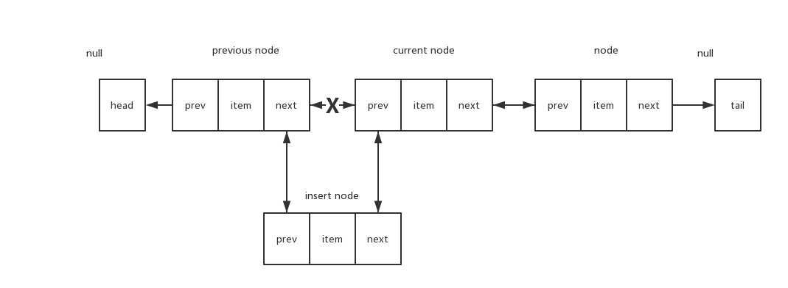

## 链表 - Linked List

### Catalog

- [What](#what)
- [How](#how)
- [API](#api)
- [Usage](#usage)
- [Where](#where)
  - [如何反转单向链表](#如何反转单向链表)

### What

数组这种数据结构有一个缺点：数组的大小是固定的，从数组的起点或者中间插入或移除项的成本很高，因为需要移除元素。

链表相对于传统的数组，链表的一个好处在于：添加或移除元素的时候不需要移动其他元素。然而链表需要指针，访问某一个元素时需要从0迭代直到找到需要的元素。

**需要添加和移除很多元素时，最好的选择是链表，而非数组。**

### How

- [单向链表](./linked-list.js)

- [双向链表](./doubly-linked-list.js)

  双向链表在某个位置插入一个元素的思想如下
  

- [循环单向链表](./circular-linked-list.js)

- 循环双向链表... ps: 很好实现

### API

#### push

| desc | param | mean | type | return |
| :---: | :---: | :--: | :--: | :--: |
| 在链表最后添加元素 | element | - | Any | - |

#### getElementAt

| desc | param | mean | type | return |
| :---: | :---: | :--: | :--: | :--: |
| 根据下标获取链表元素 | index | 下标 | Number | Node |

#### insert

| desc | param | mean | type | return |
| :---: | :---: | :--: | :--: | :--: |
| 在任意位置插入元素 | element | 插入的元素 | Any | Boolean |
|  | index | 期望插入的下标 | Number |  |

#### removeAt

| desc | param | mean | type | return |
| :---: | :---: | :--: | :--: | :--: |
| 根据下标移除某一项 | index | - | Number | Any |

#### remove

| desc | param | mean | type | return |
| :---: | :---: | :--: | :--: | :--: |
| 根据值移除某一项 | element | - | Any | - |

#### indexOf

| desc | param | mean | type | return |
| :---: | :---: | :--: | :--: | :--: |
| 获取某一项在链表中的下标 | element | - | Any | Number |

#### isEmpty

| desc | param | mean | type | return |
| :---: | :---: | :--: | :--: | :--: |
| 判断是否为空 | - | - | - | Boolean |

#### size

| desc | param | mean | type | return |
| :---: | :---: | :--: | :--: | :--: |
| 获取链表长度 | - | - | - | Number |

#### getHead

| desc | param | mean | type | return |
| :---: | :---: | :--: | :--: | :--: |
| 获取链表头 | - | - | - | Node |

#### clear

| desc | param | mean | type | return |
| :---: | :---: | :--: | :--: | :--: |
| 清空链表 | - | - | - | - |

#### toString

| desc | param | mean | type | return |
| :---: | :---: | :--: | :--: | :--: |
| 打印链表 | - | - | - | String |

#### getTail - 双向链表api

| desc | param | mean | type | return |
| :---: | :---: | :--: | :--: | :--: |
| 获取链表尾 | - | - | - | Node |

#### inverseToString - 双向链表api

| desc | param | mean | type | return |
| :---: | :---: | :--: | :--: | :--: |
| 反向打印链表 | - | - | - | String |

### Usage

to be replaced

### Where

#### 如何反转单向链表

- 见[反转单向链表](./reverse-linked-list.md)

#### 更多使用场景...

