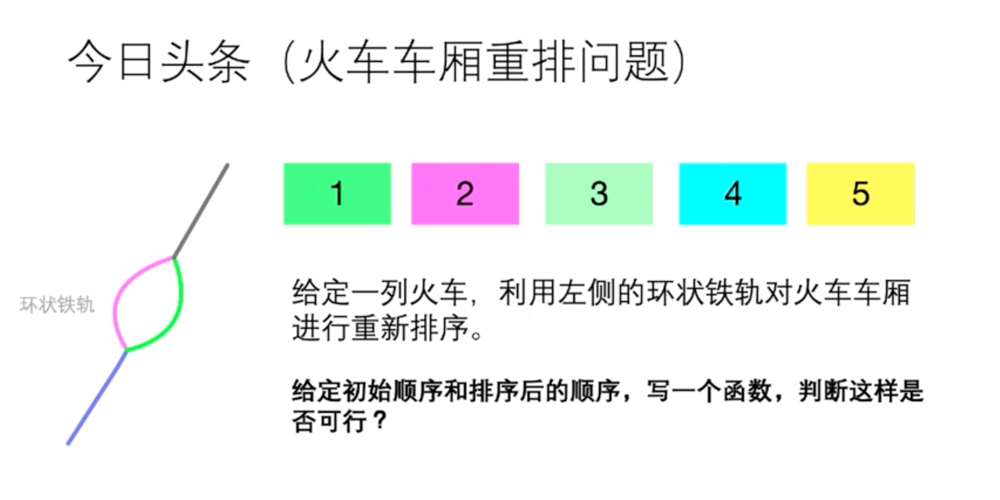
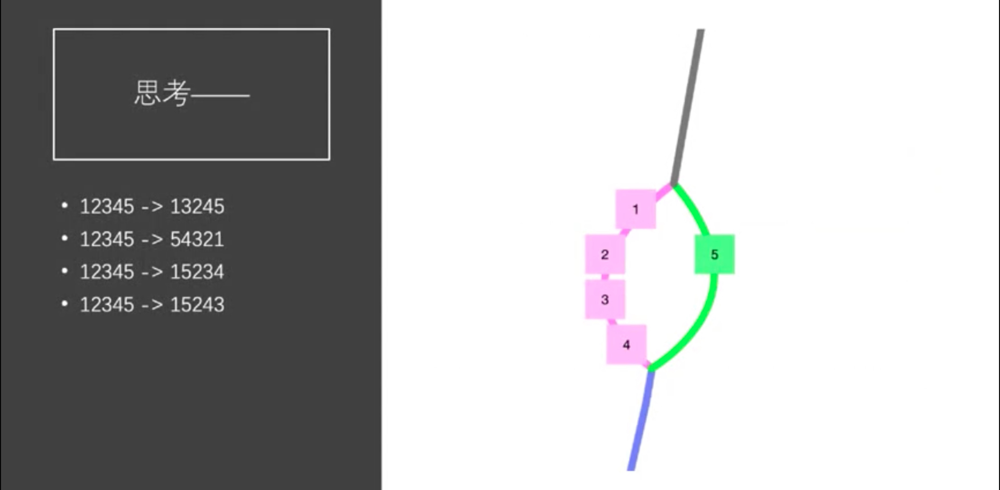
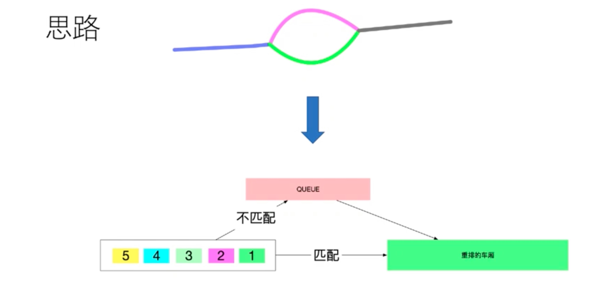
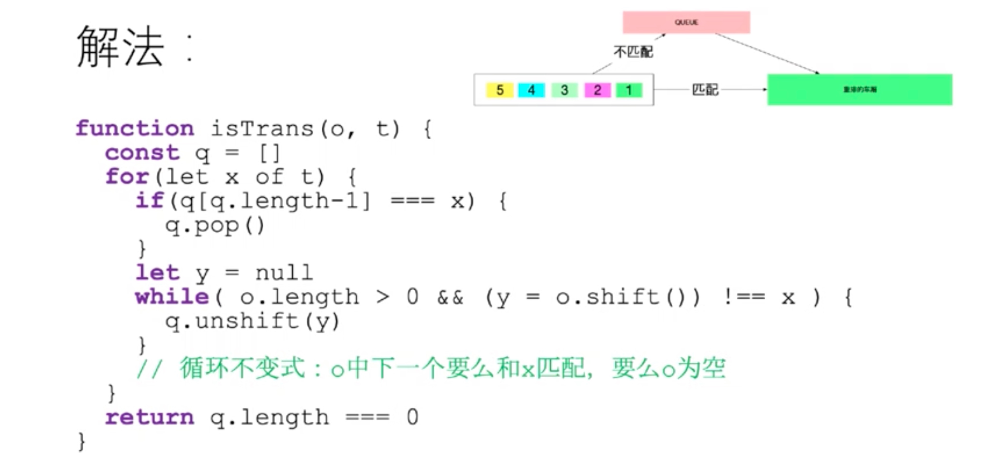
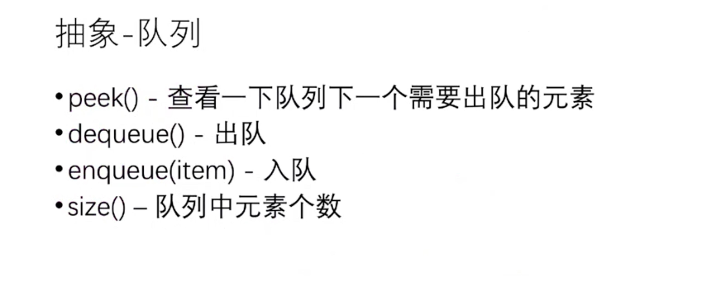
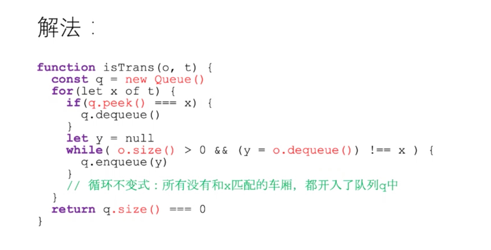

# 火车车厢重排问题

## 前言

## 分析

- 使用数组在出队时时间复杂度为O(n)
- **取而代之使用队列在出队时时间复杂度为O(1)**

## 实现

- [使用数组详细实现](./queue-problem.js#L9)
- [使用数组测试用例](../../test/queue.spec.js#L17)

- [使用队列详细实现](./queue-problem.js#L36)
- [使用队列测试用例](../../test/queue.spec.js#L28)

## 总结

