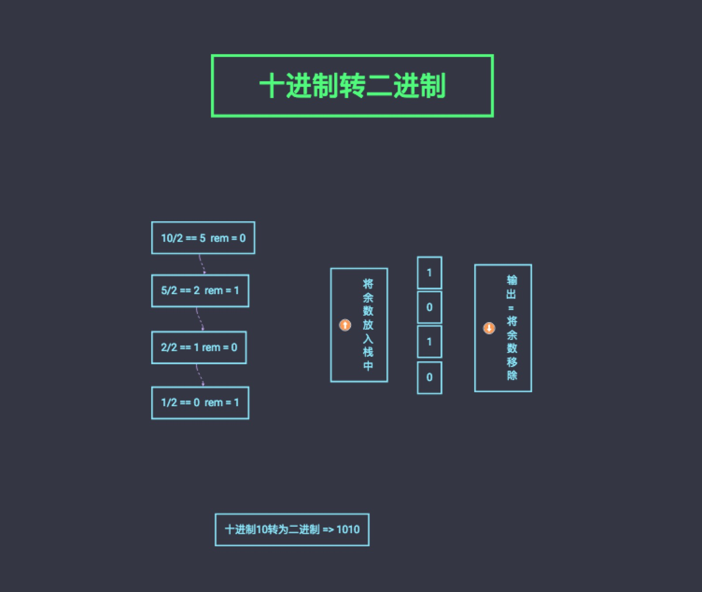

## 栈 - Stack

### Catalog

- [What](#what)
- [How](#how)
- [API](#api)
- [Usage](#usage)
- [Where](#where)

### What

栈是一种遵从后入先出（LIFO）原则的有序集合。新添加的或删除的元素都保存在栈的同一端，称作栈顶。在栈里，新元素都靠近栈顶，旧元素都接近栈底。

### How

- [使用数组实现栈](./stack-array.js)

  > 缺点：尽管代码看起来更简洁、更漂亮，变量items却是公共的。ES6的类式基于原型的。虽然基友原型的类比基于函数的类更节省内存，也更适合创建多个实例，却不能够声明私有属性（变量）或方法。

  ```js
  import { StackArray } from 'ct-dsa'
  const stack = new StackArray()
  stack.items = [] // 可以直接修改栈，不是我们期望看到的 ❌
  ```

- [使用symbol+数组实现栈](./stack-symbol.js)

  > 若不使用闭包的方式包裹，虽然看似不能修改栈，但实则可通过以下方式修改

  ```js
  import { StackSymbol } from 'ct-dsa'
  const stack = new StackSymbol()
  stack.push(5)
  const objectSymbols = Object.getOwnPropertySymbols(stack)
  console.log(objectSymbols.length) // 1
  console.log(objectSymbols) // [Symbol()]
  console.log(objectSymbols[0]) // Symbol()
  stack[objectSymbols[0]].push(1) // 可以直接修改栈，不是我们期望看到的 ❌
  stack.print() // 5, 1
  ```

  > 此方式使用闭包包裹后，items在Stack类里是真正的私有属性了，即不能随意修改。虽然看起来很丑陋，但毕竟实现了私有属性。然而，用这种方法的话，扩展类无法继承私有属性。鱼与熊掌不可兼得。

- [使用hash实现栈](./stack.js)

  > 与**使用数组实现栈**的方式相似，不同之处在于使用`hash`存储，愚以为通过栈扩展的其他数据结构若需要实现**查找某一项在其中的位置**功能时，性能更优。因为通过数组查找需要遍历一遍，时间复杂度为`O(n)`，再进行优化，使用二分查找法时间复杂度为`O(logn)`，但使用`hash`时间复杂度为`O(1)`，更优。

### API

#### stack.push(element)

| desc | param | mean | type | return |
| :---: | :---: | :--: | :--: | :--: |
| 进栈 | element | 栈内元素可为任意类型 | Any | void |

#### stack.pop()

| desc | param | mean | type | return |
| :---: | :---: | :--: | :--: | :--: |
| 出栈 | - | - | - | Any |

#### stack.peek()

| desc | param | mean | type | return |
| :---: | :---: | :--: | :--: | :--: |
| 取栈顶元素 | - | - | - | Any |

#### stack.isEmpty()

| desc | param | mean | type | return |
| :---: | :---: | :--: | :--: | :--: |
| 是否为空 | - | - | - | Boolean |

#### stack.size()

| desc | param | mean | type | return |
| :---: | :---: | :--: | :--: | :--: |
| 栈大小 | - | - | - | Number |

#### stack.clear()

| desc | param | mean | type | return |
| :---: | :---: | :--: | :--: | :--: |
| 清空栈 | - | - | - | void |

#### stack.toString()

| desc | param | mean | type | return |
| :---: | :---: | :--: | :--: | :--: |
| 打印栈 | - | - | - | String |

### Usage

```js
const { Stack } = 'ct-dsa'

const stack = new Stack() // new StackArray()

console.log('stack.isEmpty() => ', stack.isEmpty()) // outputs true

stack.push(5)
stack.push(8)

console.log('stack after push 5 and 8 => ', stack.toString())

console.log('stack.peek() => ', stack.peek()) // outputs 8

stack.push(11)

console.log('stack.size() after push 11 => ', stack.size()) // outputs 3
console.log('stack.isEmpty() => ', stack.isEmpty()) // outputs false

stack.push(15)

stack.pop()
stack.pop()

console.log('stack.size() after push 15 and pop twice => ', stack.size()) // outputs 2
```

### Where

- [十进制数转二进制数](../../example/stack/base-converter.js)
  
  > 十进制数转换为二进制数，可以把十进制数和2整除（二进制满二进一），将余数放入栈，直到结果是0为止，最后从栈中输出的值组成的字符即为结果。基本思想如上图所示。

- [十进制数转任意制数](../../example/stack/base-converter.js)
  > 基本思想与**十进制数转二进制数**一致，不同在于将十进制数和`N`进制数整除。

- 更多使用场景...

